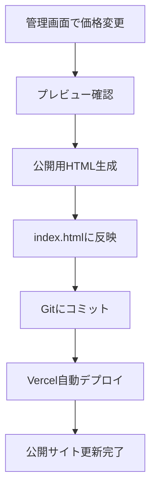

# 金属買取価格表システム

スマートフォン対応の金属買取価格表示サイトと管理システム

## 🚀 デモサイト

- **公開用ページ**: https://metal-price-site-uigq.vercel.app/
- **管理画面**: https://metal-price-site-uigq.vercel.app/admin-manager-secret.html

## 📱 概要

金属スクラップ買取業者向けの価格表示システムです。ガソリンスタンドの価格表示のようなデジタル表示で、リアルタイムの買取価格を顧客に提供します。

### 主な機能

- **スマホ最適化**: スマートフォンでの価格確認に特化
- **デジタル価格表示**: Orbitronフォントでガソリンスタンド風表示
- **管理者専用画面**: 価格の変更・管理
- **セキュリティ**: 管理画面は別URLで保護
- **即座反映**: 変更した価格をすぐに公開可能

## 🏗️ システム構成

```
metal-price-site/
├── index.html                    # 公開用価格表示ページ
├── admin-manager-secret.html     # 管理者専用画面
├── README.md                     # このファイル
└── SPECIFICATION.md              # 詳細仕様書
```

## 💻 技術スタック

- **フロントエンド**: HTML5, CSS3, Vanilla JavaScript
- **フォント**: Google Fonts (Orbitron, Noto Sans JP)
- **デプロイ**: Vercel
- **バージョン管理**: Git + GitHub

## ⚡ クイックスタート

### 1. リポジトリのクローン

```bash
git clone https://github.com/iidaatcnt/metal-price-site.git
cd metal-price-site
```

### 2. ローカル開発環境

```bash
# シンプルなHTTPサーバーで起動
python3 -m http.server 8000
# または
npx serve .
```

ブラウザで `http://localhost:8000` にアクセス

### 3. Vercelデプロイ

```bash
# Vercel CLIでデプロイ
npx vercel

# またはVercel Webサイトでリポジトリ連携
```

## 🔧 使用方法

### 顧客向け（公開ページ）

1. `https://your-site.vercel.app/` にアクセス
2. 各金属の現在価格を確認
3. 電話ボタンで直接問い合わせ可能

### 管理者向け（管理画面）

1. `https://your-site.vercel.app/admin-manager-secret.html` にアクセス
2. 各金属の価格を変更
3. 「プレビュー更新」で確認
4. 「公開用HTMLを生成」で新しいHTMLコードを取得
5. `index.html` を更新してデプロイ

## 📊 価格更新フロー



## 🔐 セキュリティ

- **管理画面URL**: 推測困難なファイル名で保護
- **アクセス制限**: 管理画面URLを知る管理者のみアクセス可能
- **データ保護**: 価格データはメモリ内でのみ管理（永続化なし）

## 🎨 カスタマイズ

### 価格項目の変更

`admin-manager-secret.html` の `priceData` オブジェクトを編集：

```javascript
let priceData = {
    copper: { name: "🔶 銅線（光線）", category: "高価買取", price: 1280, isHighValue: true },
    // 新しい金属を追加
    newMetal: { name: "🔹 新金属", category: "特別価格", price: 500, isHighValue: false }
};
```

### デザインの変更

CSS変数で簡単にカスタマイズ可能：

```css
:root {
    --primary-color: #00ff7f;    /* メインカラー */
    --accent-color: #00bfff;     /* アクセントカラー */
    --background: #1a1a2e;       /* 背景色 */
}
```

## 📱 ブラウザサポート

- Chrome 60+
- Firefox 60+
- Safari 12+
- Edge 79+
- モバイルブラウザ（iOS Safari, Chrome Mobile）

## 🚀 パフォーマンス

- **ページサイズ**: 約10KB（公開ページ）
- **読み込み時間**: <1秒
- **PWA対応**: 可能（今後の拡張）

## 🤝 貢献

1. このリポジトリをフォーク
2. 機能ブランチを作成 (`git checkout -b feature/amazing-feature`)
3. 変更をコミット (`git commit -m 'Add amazing feature'`)
4. ブランチにプッシュ (`git push origin feature/amazing-feature`)
5. Pull Requestを作成

## 📄 ライセンス

このプロジェクトはMITライセンスの下で公開されています。詳細は [LICENSE](LICENSE) ファイルを参照してください。

## 📞 サポート

- **Issues**: [GitHub Issues](https://github.com/iidaatcnt/metal-price-site/issues)
- **Email**: miidaatcnt@gmail.com

## 🗺️ ロードマップ

- [ ] PWA対応
- [ ] 価格履歴機能
- [ ] 多言語対応
- [ ] API連携
- [ ] 分析ダッシュボード

---

**Made with ❤️ for スクラップ metal dealers**