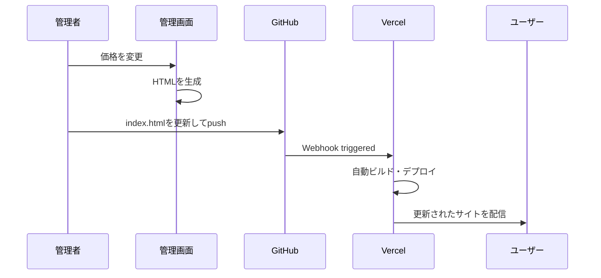

# 金属買取価格表システム 技術仕様書

## 📋 プロジェクト概要

### システム名
金属買取価格表システム (Metal Scrap Price Display System)

### 目的
金属スクラップ買取業者向けの価格表示・管理システム。ガソリンスタンドのようなデジタル価格表示でスマートフォン最適化された顧客向けページと、管理者専用の価格管理画面を提供。

### ターゲットユーザー
- **主要**: 金属スクラップ業者の顧客（スマートフォンユーザー）
- **管理者**: 買取業者の価格管理担当者

## 🏗️ システムアーキテクチャ

### アーキテクチャ概要
```
┌─────────────────┐    ┌─────────────────┐
│   顧客ユーザー   │    │   管理者ユーザー │
└─────────┬───────┘    └─────────┬───────┘
          │                      │
          ▼                      ▼
┌─────────────────┐    ┌─────────────────┐
│  公開価格ページ  │    │   管理者画面    │
│  (index.html)   │    │(admin-*.html)   │
└─────────┬───────┘    └─────────┬───────┘
          │                      │
          └──────────┬───────────┘
                     ▼
              ┌─────────────┐
              │   Vercel    │
              │   CDN/Host  │
              └─────────────┘
```

### 技術スタック詳細

#### フロントエンド
- **HTML5**: セマンティックマークアップ
- **CSS3**: 
  - Flexbox/Grid レイアウト
  - CSS Custom Properties (CSS変数)
  - CSS Animations & Transitions
  - レスポンシブデザイン
- **JavaScript**: 
  - ES6+ (Vanilla JavaScript)
  - DOM操作
  - ローカルストレージなし（意図的）

#### 外部リソース
- **Google Fonts**: 
  - Orbitron (デジタル表示用)
  - Noto Sans JP (日本語フォント)

#### デプロイメント
- **Vercel**: 静的サイトホスティング
- **GitHub**: ソースコード管理

## 📂 ファイル構成

```
metal-price-site/
│
├── index.html                    # 公開用価格表示ページ
├── admin-manager-secret.html     # 管理者専用画面
├── README.md                     # プロジェクト概要
├── SPECIFICATION.md              # 本仕様書
└── .vercel/                      # Vercelデプロイ設定（自動生成）
```

## 🎯 機能仕様

### 1. 公開用価格表示ページ (index.html)

#### 1.1 画面構成
```
┌─────────────────────────────┐
│        ヘッダー              │
│   🏅 金属買取価格表          │
│   ⚫ 2025/06/27 14:30 更新   │
├─────────────────────────────┤
│        メインコンテンツ      │
│  💡 価格は随時変動します     │
│                             │
│  ┌─金属アイテム──────────┐  │
│  │🔶 銅線（光線）      │  │
│  │高価買取           ¥1,280│  │
│  │                 / kg  │  │
│  └─────────────────────────┘  │
│  （他の金属アイテム...）     │
├─────────────────────────────┤
│        フッター（固定）      │
│  📞 0120-123-456   [今すぐ電話]│
└─────────────────────────────┘
```

#### 1.2 技術実装詳細

**HTML構造**:
```html
<div class="header">
  <div class="title">🏅 金属買取価格表</div>
  <div class="update-time">
    <span class="status-indicator"></span>
    <span id="updateTime">2025/06/27 14:30</span> 更新
  </div>
</div>

<div class="main-content">
  <div class="quick-info">💡 価格は随時変動します...</div>
  <div class="price-list">
    <div class="price-item [high-value]">
      <div class="metal-info">
        <div>
          <div class="metal-name">🔶 銅線（光線）</div>
          <div class="metal-category">高価買取</div>
        </div>
        <div>
          <div class="price-display">¥1,280</div>
          <div class="unit">/ kg</div>
        </div>
      </div>
    </div>
  </div>
</div>

<div class="contact-bar">
  <div class="phone-number">📞 0120-123-456</div>
  <a href="tel:0120-123-456" class="call-button">今すぐ電話</a>
</div>
```

**CSS設計原則**:
- Mobile First アプローチ
- BEM命名規則準拠
- CSS Custom Properties使用

**重要なCSS変数**:
```css
:root {
  --primary-color: #00ff7f;      /* メインカラー（緑） */
  --secondary-color: #00bfff;    /* セカンダリカラー（青） */
  --accent-color: #ffd700;       /* アクセントカラー（金） */
  --background-primary: #1a1a2e; /* 背景色 */
  --background-secondary: #2a2a3e; /* セカンダリ背景 */
  --text-primary: #ffffff;       /* テキスト色 */
  --text-secondary: #cccccc;     /* セカンダリテキスト */
}
```

**JavaScript機能**:
```javascript
// 時刻更新機能
function updateTime() {
  const now = new Date();
  const timeString = formatDateTime(now);
  document.getElementById('updateTime').textContent = timeString;
}

// 価格変動視覚効果
function addPriceUpdateEffect() {
  const priceItems = document.querySelectorAll('.price-item');
  setInterval(() => {
    const randomItem = priceItems[Math.floor(Math.random() * priceItems.length)];
    randomItem.classList.add('price-change');
    setTimeout(() => randomItem.classList.remove('price-change'), 500);
  }, 8000 + Math.random() * 7000);
}
```

#### 1.3 レスポンシブデザイン

**ブレイクポイント**:
- モバイル: `< 768px` (primary target)
- タブレット: `768px - 1024px`
- デスクトップ: `> 1024px`

### 2. 管理者画面 (admin-manager-secret.html)

#### 2.1 データ構造

**価格データオブジェクト**:
```javascript
let priceData = {
  copper: { 
    name: "🔶 銅線（光線）", 
    category: "高価買取", 
    price: 1280, 
    isHighValue: true 
  },
  brass: { 
    name: "🔸 真鍮", 
    category: "安定需要", 
    price: 890, 
    isHighValue: false 
  },
  stainless: { 
    name: "✨ ステンレス", 
    category: "人気商品", 
    price: 380, 
    isHighValue: false 
  },
  lead: { 
    name: "🔗 鉛", 
    category: "バッテリー等", 
    price: 320, 
    isHighValue: false 
  },
  aluminum: { 
    name: "⚪ アルミ缶", 
    category: "大量歓迎", 
    price: 180, 
    isHighValue: false 
  },
  iron: { 
    name: "⚫ 鉄スクラップ", 
    category: "基本金属", 
    price: 45, 
    isHighValue: false 
  }
};
```

#### 2.2 機能仕様

**主要機能**:
1. **価格編集**: 各金属の価格をリアルタイム編集
2. **プレビュー**: 変更内容をその場で確認
3. **HTML生成**: 公開用HTMLコードの自動生成
4. **高価買取設定**: 金色ハイライト表示の切り替え
5. **リセット機能**: 初期値への一括復元

**重要な関数**:
```javascript
// 管理画面フォーム生成
function renderAdminItems() { /* ... */ }

// プレビュー更新
function updatePreview() { /* ... */ }

// 公開用HTML生成（セキュリティ考慮）
function generatePublicHTML() { /* ... */ }

// 初期値リセット
function resetPrices() { /* ... */ }
```

#### 2.3 HTML生成機能

管理画面の重要機能として、新しい価格設定で完全な公開用HTMLファイルを生成します。

**生成されるHTML構造**:
- DOCTYPE宣言
- 完全なCSS（インライン）
- 価格データ（ハードコード）
- JavaScript機能
- レスポンシブデザイン

## 🔐 セキュリティ設計

### セキュリティ原則

1. **URL難読化**: 管理画面は推測困難なファイル名
2. **認証なし設計**: シンプルさを重視（URLによる簡易アクセス制御）
3. **データ永続化なし**: 価格データはセッション内のみ
4. **XSS対策**: innerHTML使用時のサニタイズ

### アクセス制御

- **公開ページ**: 全ユーザーアクセス可能
- **管理画面**: URLを知る管理者のみ

### 推奨セキュリティ対策

```bash
# 管理画面ファイル名の例（定期変更推奨）
admin-secret-2025-q2.html
admin-manager-june-2025.html
price-admin-confidential.html
```

## 🎨 UI/UX設計

### デザインシステム

#### カラーパレット
```css
/* プライマリカラー */
--neon-green: #00ff7f;    /* 主要アクション、価格表示 */
--neon-blue: #00bfff;     /* セカンダリ要素 */
--neon-gold: #ffd700;     /* 高価買取ハイライト */

/* 背景色 */
--dark-primary: #1a1a2e;  /* メイン背景 */
--dark-secondary: #2a2a3e; /* カード背景 */
--dark-tertiary: #1e1e32; /* グラデーション */

/* テキスト */
--text-primary: #ffffff;   /* メインテキスト */
--text-secondary: #cccccc; /* サブテキスト */
--text-muted: #999999;     /* 補足テキスト */
```

#### タイポグラフィ
```css
/* フォントファミリー */
--font-primary: 'Noto Sans JP', sans-serif;  /* 日本語テキスト */
--font-digital: 'Orbitron', monospace;       /* デジタル表示 */

/* フォントサイズ（モバイル） */
--font-size-xs: 0.8rem;   /* 補足テキスト */
--font-size-sm: 0.9rem;   /* 小テキスト */
--font-size-base: 1rem;   /* 基本サイズ */
--font-size-lg: 1.1rem;   /* 金属名 */
--font-size-xl: 1.5rem;   /* タイトル */
--font-size-2xl: 2.2rem;  /* 価格表示 */
```

#### レスポンシブ設計
```css
/* モバイルファースト */
.price-display {
  font-size: 2.2rem;
}

/* タブレット以上 */
@media (min-width: 768px) {
  .price-display {
    font-size: 2.5rem;
  }
}
```

### アニメーション設計

#### 重要なアニメーション
```css
/* パルス効果（ステータスインジケーター） */
@keyframes pulse {
  0%, 100% { opacity: 1; }
  50% { opacity: 0.5; }
}

/* 価格更新エフェクト */
@keyframes priceUpdate {
  0% { background-color: rgba(0,255,127,0.3); }
  100% { background-color: transparent; }
}

/* グロー効果 */
@keyframes priceGlow {
  from { text-shadow: 0 0 15px rgba(0,255,127,0.8); }
  to { text-shadow: 0 0 25px rgba(0,255,127,1); }
}
```

## 🚀 デプロイメント

### Vercel設定

**デプロイ方法**:
1. GitHub連携による自動デプロイ
2. プッシュトリガーでの自動更新

**環境設定**:
```json
{
  "framework": null,
  "buildCommand": null,
  "installCommand": null,
  "outputDirectory": "."
}
```

### 更新フロー



## 🧪 テスト仕様

### 手動テスト項目

#### 公開ページ
- [ ] 価格表示が正常に表示される
- [ ] 電話ボタンが機能する (`tel:` リンク)
- [ ] 時刻が定期更新される
- [ ] 価格変動アニメーションが動作する
- [ ] レスポンシブデザインが機能する

#### 管理画面
- [ ] 価格入力フォームが動作する
- [ ] プレビュー更新が正常に動作する
- [ ] HTML生成機能が動作する
- [ ] 生成されたHTMLが有効である
- [ ] リセット機能が動作する

#### ブラウザテスト
- [ ] Chrome (最新版)
- [ ] Firefox (最新版)
- [ ] Safari (iOS)
- [ ] Chrome Mobile (Android)

## 📊 パフォーマンス要件

### 目標指標
- **初回読み込み**: < 1秒
- **LCP (Largest Contentful Paint)**: < 2.5秒
- **FID (First Input Delay)**: < 100ms
- **CLS (Cumulative Layout Shift)**: < 0.1

### 最適化手法
- CSS/JS インライン化
- 画像なし（絵文字のみ使用）
- CDN経由でのフォント読み込み
- 最小限のJavaScript

## 🔧 拡張性設計

### 将来の機能拡張

#### 短期（1-3ヶ月）
- [ ] PWA対応
- [ ] オフライン表示
- [ ] プッシュ通知

#### 中期（3-6ヶ月）
- [ ] 価格履歴表示
- [ ] 複数店舗対応
- [ ] 分析ダッシュボード

#### 長期（6ヶ月以上）
- [ ] API連携
- [ ] データベース統合
- [ ] 多言語対応
- [ ] 管理者認証システム

### API設計案（将来）
```javascript
// RESTful API設計例
GET    /api/v1/prices           // 価格一覧取得
PUT    /api/v1/prices/{metal}   // 特定金属価格更新
POST   /api/v1/prices/bulk      // 一括価格更新
GET    /api/v1/prices/history   // 価格履歴取得
```

## 🐛 既知の制限事項

1. **認証なし**: URLベースの簡易アクセス制御のみ
2. **データ永続化なし**: ページリロードで設定リセット
3. **バックアップなし**: 管理画面での変更履歴なし
4. **同時編集非対応**: 複数管理者の同時編集未考慮

## 📝 開発ガイドライン

### コーディング規約

#### HTML
- セマンティックマークアップ使用
- ARIA属性の適切な設定
- 適切なheading階層

#### CSS
- BEM命名規則
- Mobile First アプローチ
- CSS Custom Properties活用
- 単一責任原則

#### JavaScript
- ES6+構文使用
- 関数型プログラミング指向
- コメントによる意図明示
- エラーハンドリング実装

### Git運用

#### ブランチ戦略
- `main`: 本番環境
- `develop`: 開発環境
- `feature/*`: 機能開発
- `hotfix/*`: 緊急修正

#### コミットメッセージ
```
feat: 新機能追加
fix: バグ修正
docs: ドキュメント更新
style: フォーマット変更
refactor: リファクタリング
test: テスト追加・修正
```

## 📞 サポート・連絡先

- **開発者**: iida
- **Email**: miidaatcnt@gmail.com
- **GitHub**: https://github.com/iidaatcnt/metal-price-site
- **Issues**: https://github.com/iidaatcnt/metal-price-site/issues

---

**最終更新**: 2025年6月27日
**バージョン**: 1.0.0
**文書形式**: Markdown